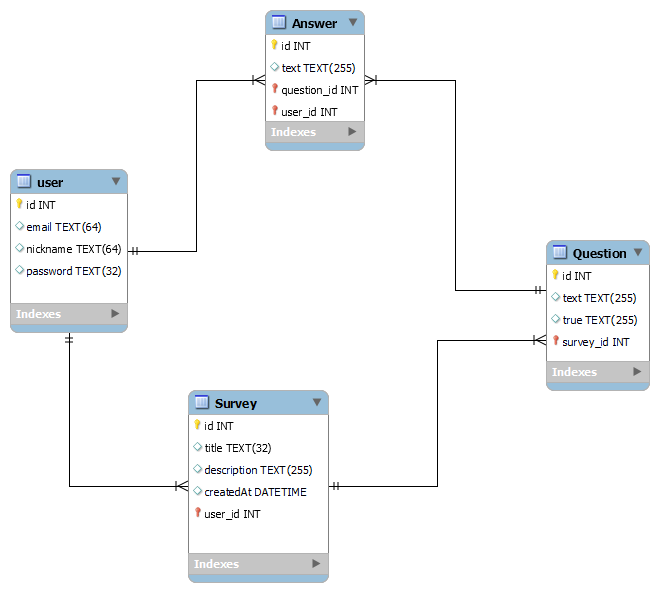

# Проєктування бази даних

## Mодель бізнес-об'єктів

@startuml

    entity User
    entity Survey
    entity Question
    entity Answer
    entity User_Token
    

    
    User "1,1"--"0,*" Answer
    User "1,1"--"0,*" User_Token
    User "1,1"--"0,*" Survey
    Survey "1,1"*--"0,*" Question
    Answer "0,*"--*"1,1" Question
    

    entity User.id
    entity User.nickname
    entity User.email
    entity User.password
    
   
    entity user_token.id
    entity user_token.token
    entity user_token.create_time
    entity user_token.valid
    

    

    entity Survey.id
    entity Survey.title
    entity Survey.description
    entity Survey.createdAt

    entity Question.id
    entity Question.text
    entity Question.true

    entity Answer.id
    entity Answer.text

    
    
    user_token.id --* User_Token
    user_token.token --* User_Token
    user_token.create_time --* User_Token
    user_token.valid --* User_Token

    User.id --* User
    User.nickname --* User
    User.email --* User
    User.password --* User

    Survey *-- Survey.id
    Survey *-- Survey.title
    Survey *-- Survey.description
    Survey *-- Survey.createdAt

    Question *-- Question.id
    Question *-- Question.text
    Question *-- Question.true

    Answer *-- Answer.id
    Answer *-- Answer.text

@enduml

## ER-модель

@startuml

    package UserControl {
        entity User
        {
            id: INT
            nickname: TEXT
            email: TEXT
            password: TEXT
        }
        entity User_Token
        {
            id: INT
            token: TEXT
            create_time: DATETIME
            valid: DATETIME
        }
        
    }
   
    
    package SurveyControl {
        entity Survey
        {
        id: INT
        title: TEXT
        description: TEXT
        created: DATE
        }

        entity Answer
        {
            id: INT
            text: TEXT
        }
 
        entity Question
        {
            id: INT
            text: TEXT
            true: TEXT
        }
    
        
    }
    
    User "1,1"--"0,*" Answer
    User "1,1"--"0,*" Survey
    User "1,1"--"0,*" User_Token
    
    Survey "1,1"*--"0,*" Question
    Answer "0,*"--*"1,1" Question

@enduml

## Реляційна схема
